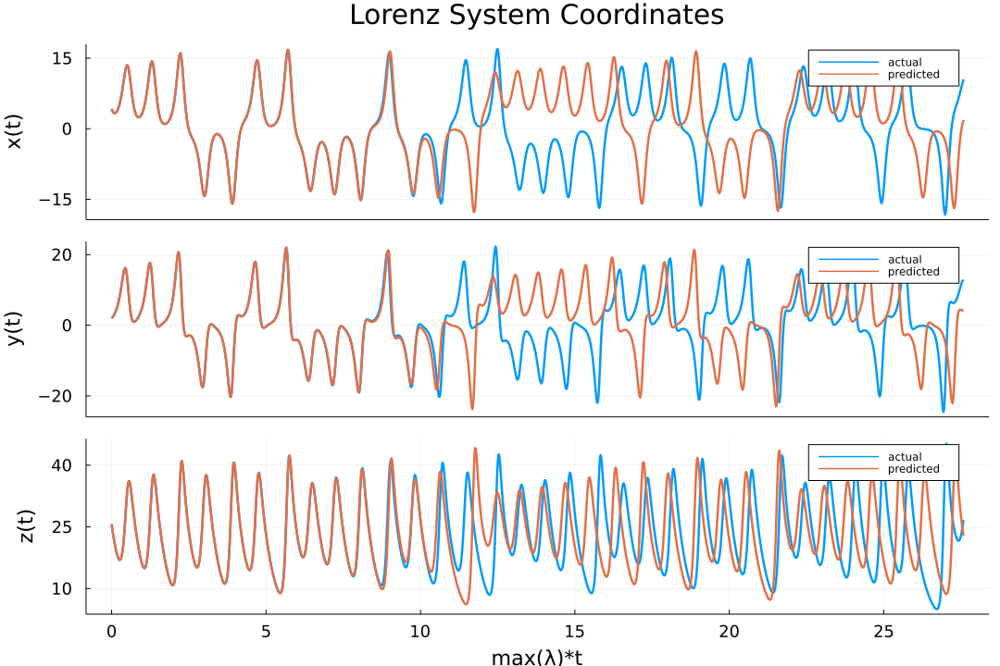

 # Lorenz System Forecasting
 
This example expands on the readme Lorenz system forecasting to better showcase how to use methods and functions provided in the library for Echo State Networks. Here the prediction method used is ```Generative```, for a more detailed explanation of the differences between ```Generative``` and ```Predictive``` please refer to the other examples given in the documentation. The full script for this example is available [here](scripts/lorenz_basic.jl).

## Generating the data
Starting off the workflow the first step is to obtain the data. Leveraging ```OrdinaryDiffEq``` it is possible to derive the Lorenz system data in the following way:
```julia
using OrdinaryDiffEq

#define lorenz system
function lorenz!(du,u,p,t)
    du[1] = 10.0*(u[2]-u[1])
    du[2] = u[1]*(28.0-u[3]) - u[2]
    du[3] = u[1]*u[2] - (8/3)*u[3]
end

#solve and take data
prob = ODEProblem(lorenz!, [1.0,0.0,0.0], (0.0,200.0))
data = solve(prob, ABM54(), dt=0.02)
```

After obtaining the data it is necessary to determine the kind of prediction for the model. Since this example is going to use the ```Generative``` prediction type, this means that the target data is foing to be the next step of the input data. In addition it is important to notice that the Lorenz system just obtained presents a transient period that is not representative of the general behavior of the system. This can easily be discarded setting a ```shift``` parameter.
```julia
#determine shift length, training length and prediction length
shift = 300
train_len = 5000
predict_len = 1250

#split the data accordingly
input_data = data[:, shift:shift+train_len-1]
target_data = data[:, shift+1:shift+train_len]
test_data = data[:,shift+train_len+1:shift+train_len+predict_len]
```

It is *important* to notice that the data needs to be formatted in a matrix with the features as rows and timesteps as columns like it is done in this example. This is needed even if the timeserie consists of single values. 

## Building the Echo State Network
Once the data is ready it is possible to define the parameters for the ESN and the ```ESN``` struct itself. In this example the values from [^1] are loosely followed as general guidelines.
```julia
using ReservoirComputing

#define ESN parameters
res_size = 300
res_radius = 1.2
res_sparsity = 6/300
input_scaling = 0.1

#build ESN struct
esn = ESN(input_data; 
    variation = Default(),
    reservoir_init = RandSparseReservoir(res_size, radius=res_radius, sparsity=res_sparsity),
    input_init = WeightedLayer(scaling=input_scaling),
    reservoir_driver = RNN(),
    nla_type = NLADefault(),
    states_type = StandardStates())
```

Most of the parameters here chosen mirror the default ones, so a direct call is not necessary. The readme example is identical to this one, except for the explicit call. Going line by line to see what is happening starting from ```res_size```: this value determines the dimensions of the reservoir matrix. In this case a size of 300 has been chosen, so the reservoir matrix is going to be 300 x 300. This is not always the case, since some input layer constructions can modify the dimensions of the reservoir, but in that case everything is taken care of internally. 

The ```res_radius``` determines the scaling of the spectral radius of the reservoir matrix; a proper scaling is necessary to assure the Echo State Property. The default value in the ```RandSparseReservoir()``` method is 1.0 in accordance to the most followed guidelines found in the literature (see [^2] and references therein). The ```sparsity``` of the reservoir matrix in this case is obtained by choosing a degree of connections and dividing that by the reservoir size. Of course it is also possible to simply choose any value between 0.0 and 1.0 to test behaviors for different sparsity values. In this example the call to the parameters inside ```RandSparseReservoir()``` was done explicitly to showcase the meaning of each of them, but it is aslo possible to simply pass the values directly like so ```RandSparseReservoir(1.2, 6/300)```.

The value of ```input_scaling``` determines the upper and lower bounds of the uniform distribution of the weights in the ```WeightedLayer()```. Like before this value can be passed either as argument or keyword argument ```WeightedLayer(0.1)```. The value of 0.1 represents the default. The default input layer is the ```DenseLayer```, a fully connected layer. The details of the weighted version can be found in [^3], for this example this version returns the best results.

The reservoir driver represents the dynamics of the reservoir. In the standard ESN definition these dynamics are obtained through a Recurrent Neural Network (RNN), and this is reflected by calling the ```RNN``` driver for the ```ESN``` struct. This option is set as the default and unless there is the need to change parameters it is not needed. The full equation is the following:
```math
\textbf{x}(t+1) = (1-\alpha)\textbf{x}(t) + \alpha \cdot \text{tanh}(\textbf{W}\textbf{x}(t)+\textbf{W}_{\text{in}}\textbf{u}(t))
```
where ``α`` represents the leaky coefficient and tanh can be any activation function. Also ``\textbf{x}`` represent the state vector, ``\textbf{u}`` the input data and ``\textbf{W}, \textbf{W}_{\text{in}}`` are the reservoir matrix and input matrix respectively. The default call to the RNN in the library is the following ```RNN(;activation_function=tanh, leaky_coefficient=1.0)```, where the meaning of the parameters is clear from the equation above. Instead og the hyperbolic tangent any activation function can be used, either leveraging external lybraries such as ```NNlib``` or creating a custom one. 

The final calls are modifications to the states in training or prediction. The default calls, depicted in the example, do not apport any modifications to the states. This is the safest bet is one is not sure on how these work. The ```nla_type``` applies a non linear algorithm to the states, while the ```states_type``` can expand them concatenating them with the inpu data, or padding them concatenating a constant value to all the states. More in depth descriptions about these parameters are given in other examples in the documentation.

## Training and Prediction
Now that the ESN has been created and all the parameters have been explained it is time to proceed with the training. The full call of the readme example follows this general idea:
```julia
#define training method
training_method = StandardRidge(0.0)

#obtain output layer
output_layer = train(esn, target_data, training_method)
```

The training returns an ```OutputLayer``` struct containing the trained output matrix and other informations needed for the prediction. The necessary elements in the ```train()``` call are the ```ESN``` struct created in the previous step and the ```target_data```, that in this case is the one step ahead evolution of the Lorenz system. The training method chosen in this example is the standard one, so an equivalent way of calling the ```train``` function here is ```output_layer = train(esn, target_data)``` like the readme basic version. Likewise the default value for the ridge regression parameter is set to zero, so the actual default training is Ordinary Least Squares regression. Other training methods are available and will be explained in following examples. 

Once the ```OutputLayer``` has been obtained the prediction can be done following this procedure:
```julia
output = esn(Generative(predict_len), output_layer)
```
both the training method and the output layer are needed in this call. The number of steps for the prediction must be specified to the ```Generative``` method. The output results are given in a matrix. 
To inspect the results they can easily be plotted using an external library. In this case ```Plots``` is adopted:
```julia
using Plots, Plots.PlotMeasures

ts = 0.0:0.02:200.0
lorenz_maxlyap = 0.9056
predict_ts = ts[shift+train_len+1:shift+train_len+predict_len]
lyap_time = (predict_ts .- predict_ts[1])*(1/lorenz_maxlyap)

p1 = plot(lyap_time, [test_data[1,:] output[1,:]], label = ["actual" "predicted"], 
    ylabel = "x(t)", linewidth=2.5, xticks=false, yticks = -15:15:15);
p2 = plot(lyap_time, [test_data[2,:] output[2,:]], label = ["actual" "predicted"], 
    ylabel = "y(t)", linewidth=2.5, xticks=false, yticks = -20:20:20);
p3 = plot(lyap_time, [test_data[3,:] output[3,:]], label = ["actual" "predicted"], 
    ylabel = "z(t)", linewidth=2.5, xlabel = "max(λ)*t", yticks = 10:15:40);


plot(p1, p2, p3, size=(1080, 720), plot_title = "Lorenz System Coordinates", 
    layout=(3,1), xtickfontsize = 12, ytickfontsize = 12, xguidefontsize=15, yguidefontsize=15,
    legendfontsize=12, titlefontsize=20, left_margin=4mm)
```




## Bibliography

[^1]: Pathak, Jaideep, et al. "_Using machine learning to replicate chaotic attractors and calculate Lyapunov exponents from data._" Chaos: An Interdisciplinary Journal of Nonlinear Science 27.12 (2017): 121102.
[^2]: Lukoševičius, Mantas. "_A practical guide to applying echo state networks._" Neural networks: Tricks of the trade. Springer, Berlin, Heidelberg, 2012. 659-686.
[^3]: Lu, Zhixin, et al. "_Reservoir observers: Model-free inference of unmeasured variables in chaotic systems._" Chaos: An Interdisciplinary Journal of Nonlinear Science 27.4 (2017): 041102.

